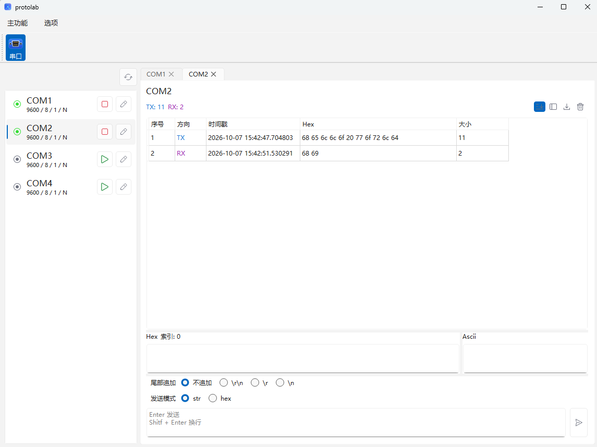
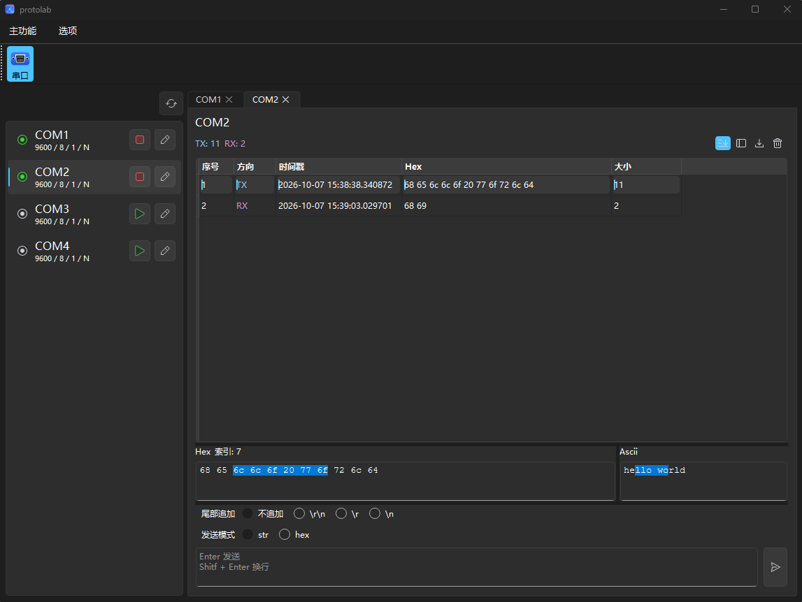

## 一个简单的 调试软件
  - ps: 目前只做了串口, 后续加入更多功能, 占个坑先🤪

## 串口调试功能概览
- 多串口管理
- hex列表视图
- hex-ascii查看, 同步两侧选中

### 截图:

## 其实这个还是一个应用的脚手架
- ui自动生成py文件
- 自动生成资源文件的引用
- 自动生成图标的引用
- 深浅主题切换 (主题颜色系统借鉴[material-ui](https://mui.com/material-ui/customization/default-theme/))
- i18n文件生成
- 分离开发和运行的代码目录
- 尽可能减少qss样式使用, 用基本元素实现功能, 用qss也尽量减少作用范围, 避免样式污染
